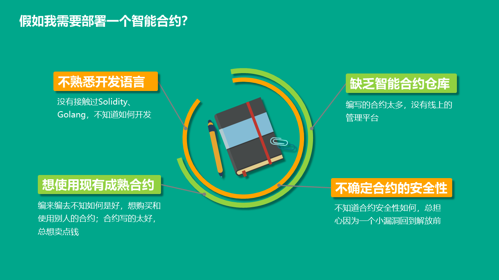
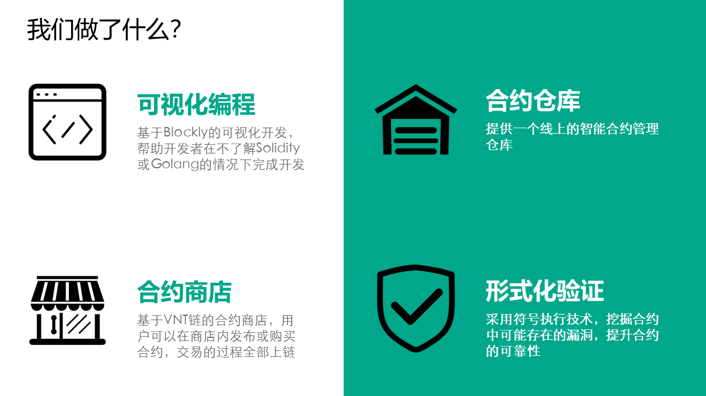
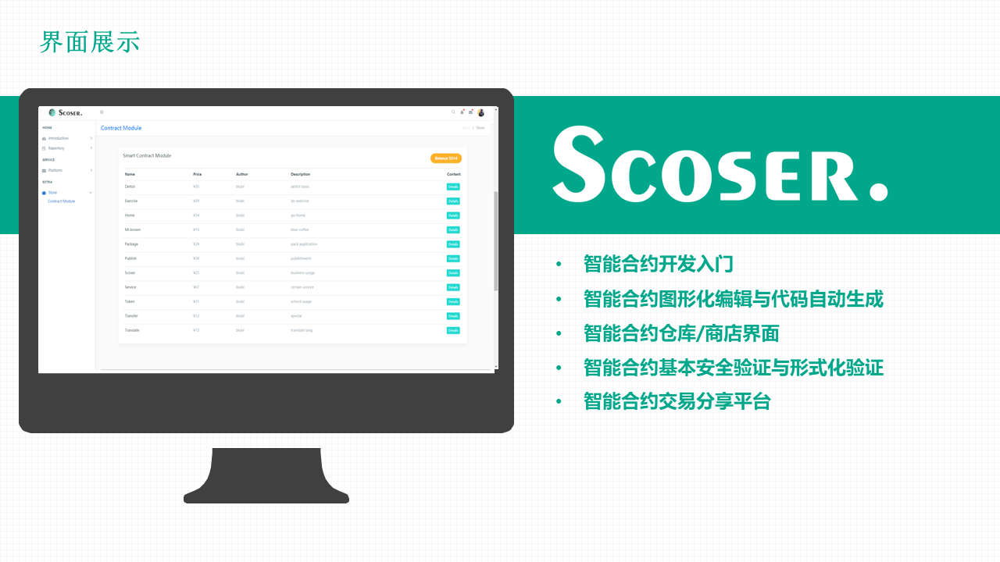

# Bitrun-upload

## 项目简介

针对智能合约集成化在线服务的不足，我们提供了一种基于区块链的智能合约集成服务系统，为用户提供系统账户，实现智能合约的图形可视编辑与快速代码生成、支持多语言和形式化安全验证和审计以及基于商店的可信优质合约分享和服务交易等集成化的统一在线服务系统。  

 

 

 
 
 

## 运行方法
```sh
Run:
  node designer.js
```
